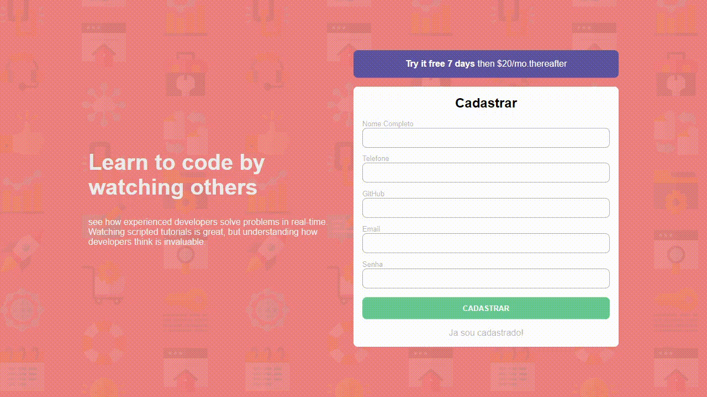

# Cadastro Vue

### Aplicação para cadastro e login, criada com VueJS com base em uma tela existente.

### Tecnologias utilizadas: 

### Demonstração

    

### Como executar

- Clone o repositório
- Instale as dependências com `npm install` ou `yarn`
- Inicie o JSON Server com `npm run api` ou `yarn api`
- Inicie a aplicação com `npm run serve` ou `yarn serve`